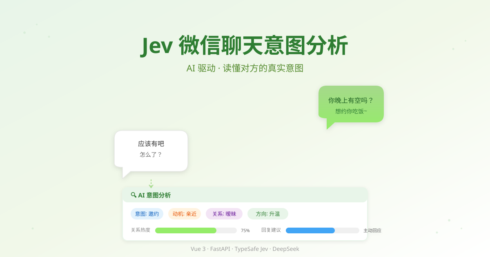

<div align="center">



# Jev 微信聊天意图分析

一个基于 AI 的微信聊天意图分析 Web 应用，帮助你读懂对方的真实意图。

[](https://vuejs.org/)
[](https://vitejs.dev/)
[](https://fastapi.tiangolo.com/)
[](https://www.typescriptlang.org/)
[](https://www.python.org/)

</div>

---

## ✨ 功能特性

| 功能 | 说明 |
|------|------|
| 💬 **聊天文本解析** | 粘贴聊天记录，自动识别发送者并渲染为微信气泡布局 |
| 🎯 **逐条意图分析** | 对"对方"每条消息调用 Jev AI，判断意图、动机、关系信号等维度 |
| 📊 **会话级 Dashboard** | Signal Engine 聚合整段对话，输出整体方向、主导动机、指标均值 |
| 💡 **智能回复策略** | 结合 DeepSeek，为每条对方消息生成贴合语气的回复建议 |
| 🎨 **微信风格 UI** | 左侧气泡 + 右侧分析卡片，绿色自己 / 白色对方，还原微信体验 |

## 🖼️ 界面预览


- **左侧**：微信风格聊天气泡，对方消息下方自动展开分析卡片
- **右侧**：文本输入区，粘贴聊天记录并选择"对方"发送者
- **分析维度**：意图、动机、关系、对话方向 + 7 项关系热度评分

## 🛠️ 技术栈

### 前端
- **Vue 3** + **TypeScript** + **Vite**
- **Axios** 与后端通信

### 后端
- **FastAPI** + **Uvicorn**
- **TypeSafe SDK** — 调用 Jev 模型进行意图分析
- **DeepSeek API** — 生成会话级回复策略
- **Pydantic** 数据校验

## 📁 项目结构

```
1111vibecoding/
├── Jev/                      # 前端 (Vue3 + Vite)
│   ├── src/
│   │   ├── components/
│   │   │   ├── MessageBubble.vue      # 聊天气泡组件
│   │   │   ├── AnalysisCard.vue       # 分析结果卡片
│   │   │   └── DashboardCard.vue      # 会话级 Dashboard
│   │   ├── App.vue                    # 主页面（两栏布局）
│   │   ├── api.ts                     # API 封装
│   │   └── style.css                  # 微信风格样式
│   ├── vite.config.ts
│   └── package.json
│
├── JevFastAPIProject/        # 后端 (FastAPI)
│   ├── main.py                # 路由入口
│   ├── jev_questions.py       # Jev 预制 12 维 taxonomy
│   ├── signal_engine.py       # 证据抽取 + 会话级聚合
│   ├── deepseek_client.py     # DeepSeek 回复策略生成
│   ├── requirements.txt
│   └── .env                   # API Key（不提交）
│
└── docs/                      # 文档图片
    ├── banner.svg
    └── ui-preview.svg
```

## 🚀 快速开始

### 环境要求

- Node.js ≥ 18
- Python ≥ 3.10
- 有效的 API Key（见下方配置）

### 1. 克隆仓库

```bash
git clone <your-repo-url>
cd 1111vibecoding
```

### 2. 配置后端环境变量

在 `JevFastAPIProject/` 下创建 `.env` 文件：

```env
# TypeSafe (Jev) API Key — 用于意图分析
TYPESAFE_API_KEY=your_typesafe_api_key

# DeepSeek API Key — 用于回复策略生成（可选）
DEEPSEEK_API_KEY=your_deepseek_api_key
```

> ⚠️ `.env` 已加入 `.gitignore`，不会被提交到仓库。

### 3. 启动后端

```bash
cd JevFastAPIProject
python -m venv .venv
.venv\Scripts\activate        # Windows
# source .venv/bin/activate   # macOS / Linux

pip install -r requirements.txt
uvicorn main:app --reload --port 8000
```

后端运行于 `http://localhost:8000`，API 文档见 `http://localhost:8000/docs`。

### 4. 启动前端

```bash
cd Jev
npm install
npm run dev
```

前端运行于 `http://localhost:5173`，已通过 Vite 代理转发 `/api` 请求到后端。

## 📡 API 接口

| 方法 | 路径 | 说明 |
|------|------|------|
| `POST` | `/api/parse` | 解析聊天文本为结构化消息列表 |
| `POST` | `/api/analyze` | 逐条 Jev 分析 + 会话级 Dashboard + 回复策略 |

### 解析请求示例

```json
POST /api/parse
{
  "text": "A：你晚上有空吗？\nB：应该有吧，怎么了？\nA：没什么，就问问。"
}
```

### 分析请求示例

```json
POST /api/analyze
{
  "messages": [
    { "sender": "A", "text": "你晚上有空吗？" },
    { "sender": "B", "text": "应该有吧，怎么了？" }
  ],
  "other_sender": "B"
}
```

## 🔄 工作流程

```
粘贴聊天文本
      ↓
POST /api/parse → 解析为消息列表 + 发送者
      ↓
选择"对方"发送者
      ↓
POST /api/analyze
      ├─ 逐条对方消息 → Jev (12维意图分析)
      ├─ Signal Engine → 会话级 Dashboard (聚合/趋势/证据)
      └─ DeepSeek → 整体策略 + 每条回复建议
      ↓
左侧气泡展示分析卡片 + 右侧 Dashboard
```

## 📝 使用说明

1. 在右侧文本框粘贴聊天记录（格式：`A：内容` / `B：内容`，支持中英文冒号）
2. 点击 **解析**，系统识别出所有发送者
3. 从下拉框中选择 **"对方"** 是谁
4. 点击 **分析对方消息**，等待 AI 逐条分析
5. 每条对方消息下方自动展开分析卡片（意图、动机、关系信号等）
6. 顶部 Dashboard 展示整段对话的整体判断与回复策略

## 📄 License

MIT
